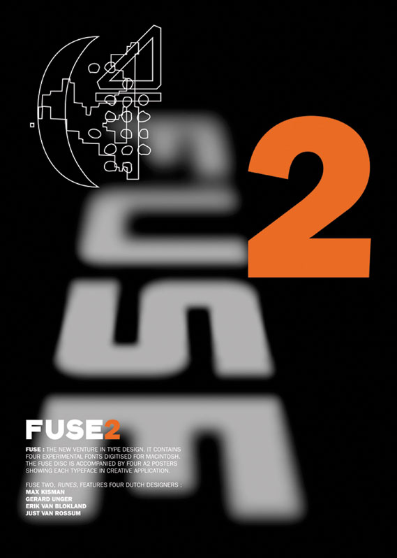

# Design Stuff
#### A Collection of Design ideas, inspiration, and implementation

## Books and Tools used

- The Elements of Graphic Design - Second Edition
  - Alex W. White

## Image Credit
- [Poster for Hans Poelzig](https://www.moma.org/collection/works/5101)
- [Paula Scher - art is...](http://images.lib.ncsu.edu/luna/servlet/detail/NCSULIB~1~1~105880~179670:School-of-Visual-Arts-Poster--Art-I)
- Neville Brody Fuse 2 poster 
